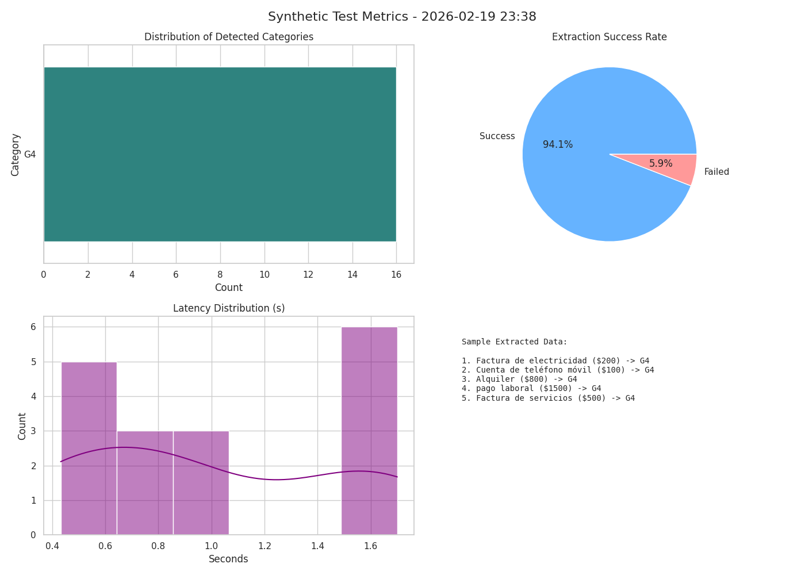

# 💰 Personal Financial Tracker — SIC 2025

Chatbot de finanzas personales con **Inteligencia Artificial** que registra ingresos y gastos mediante lenguaje natural, los clasifica automáticamente usando **SVM + DistilBERT**, y predice tu gasto mensual con **Regresión Polinómica**.

## ✨ Características

| Módulo                         | Descripción                                                                                                    |
| ------------------------------ | -------------------------------------------------------------------------------------------------------------- |
| 💬 **Chatbot Conversacional**  | Interacción en lenguaje natural con LLM (Ollama / LLaMA 3.2). El usuario declara gastos e ingresos libremente. |
| 🤖 **Clasificación en Tiempo Real** | Cada concepto se clasifica automáticamente en categoría usando SVM + DistilBERT embeddings.               |
| 🗄️ **Persistencia en SQLite** | Todas las transacciones se guardan en base de datos, consultables desde el historial.                          |
| 📊 **Análisis de Gastos**      | Resumen por categoría con barras de progreso + predictor de gasto mensual (Regresión Polinómica grado 2).      |
| 🎯 **Metas Financieras**       | Sliders interactivos para distribuir presupuesto por categoría + consejo del asesor IA.                        |
| 📥 **Exportar a Excel**        | Genera un `.xlsx` formateado con todas las transacciones registradas.                                          |

## 🏗️ Arquitectura

```
PersonalFinancialTracker_SIC2025/
├── Backend&Algorithms/
│   ├── server.py              # FastAPI — API principal
│   ├── database.py            # SQLite — persistencia
│   ├── classifier.py          # SVM + DistilBERT — clasificador de categorías
│   ├── predictor.py           # Regresión Polinómica — predicción de gasto
│   ├── modelo_svm_entrenado.pkl
│   ├── pca_entrenado.pkl
│   ├── le_entrenado.pkl
│   ├── requirements.txt
│   ├── SVM3.py                # Script de entrenamiento SVM (referencia)
│   ├── NLPBERT.py             # NLP/BERT utilities (referencia)
│   └── RegresionPolinomica.py # Script de entrenamiento regresión (referencia)
├── DataBase/
│   ├── dataset_gestor_gastos.csv   # Dataset para regresión polinómica
│   └── ...otros CSVs de referencia
├── chatbot-angular/           # Frontend Angular
│   └── src/
│       ├── app/
│       │   ├── chatbot/            # 💬 Chat principal
│       │   ├── historial/          # 📋 Historial de transacciones
│       │   ├── analisis-gastos/    # 📊 Análisis + predictor
│       │   ├── metas-financieras/  # 🎯 Distribución de presupuesto
│       │   ├── contacto/           # 📩 Contacto / Acerca de
│       │   └── services/
│       │       └── finanzas.service.ts  # Servicio HTTP unificado
│       ├── styles.css              # Design system global
│       ├── main.ts
│       └── index.html
└── README.md
```

## 🛠️ Tecnologías

- **Backend:** Python · FastAPI · Uvicorn
- **LLM:** Ollama con `llama3.2:3b`
- **ML — Clasificación:** SVM (scikit-learn) + DistilBERT (Hugging Face Transformers)
- **ML — Predicción:** Regresión Polinómica grado 2 (scikit-learn)
- **Base de Datos:** SQLite
- **Frontend:** Angular 17+ (standalone components)
- **Excel:** XlsxWriter / Pandas

## 🚀 Instalación y Ejecución

### 1. Clonar el Repositorio

```bash
git clone https://github.com/FutilePanic82/PersonalFinancialTracker_SIC2025
cd PersonalFinancialTracker_SIC2025
```

### 2. Backend — Python

```bash
cd "Backend&Algorithms"
python -m venv venv
source venv/bin/activate        # En Windows: venv\Scripts\activate
pip install -r requirements.txt
```

### 3. Instalar y ejecutar Ollama

```bash
# Instalar Ollama (https://ollama.com)
ollama pull llama3.2:3b
ollama serve                    # Dejar corriendo en otra terminal
```

### 4. Iniciar el Backend

```bash
cd "Backend&Algorithms"
uvicorn server:app --host 0.0.0.0 --port 8000 --reload
```

### 5. Frontend — Angular

```bash
cd chatbot-angular
npm install
ng serve                        # http://localhost:4200
```

## 📡 API Endpoints

| Método   | Ruta            | Descripción                                                       |
| -------- | --------------- | ----------------------------------------------------------------- |
| `POST`   | `/conversation` | Envía mensaje; extrae y clasifica transacciones automáticamente   |
| `GET`    | `/historial`    | Retorna todas las transacciones almacenadas                       |
| `POST`   | `/finalize`     | Genera y descarga archivo Excel                                   |
| `POST`   | `/predict`      | Predicción de gasto (regresión polinómica)                        |
| `POST`   | `/metas`        | Recibe distribución de presupuesto, devuelve consejo del asesor IA|
| `DELETE` | `/reset`        | Reinicia conversación en memoria                                  |

### Ejemplo — `/conversation`

**Request:**
```json
{
  "chat_history": [
    { "role": "user", "content": "Gasté $500 en comida y recibí $15000 de sueldo" }
  ]
}
```

**Response:**
```json
{
  "response": "He registrado tu gasto de $500 en comida y tu ingreso de $15,000.",
  "transacciones_detectadas": [
    { "concepto": "comida", "monto": 500, "categoria": "Alimentación", "tipo": "gasto" },
    { "concepto": "sueldo", "monto": 15000, "categoria": "Ingresos", "tipo": "ingreso" }
  ]
}
```

### Ejemplo — `/predict`

**Request:**
```json
{ "ingresos": 15000, "hijos": 1, "edad": 30, "educacion": 2 }
```

**Response:**
```json
{
  "gasto_predicho": 11250.50,
  "r2": 0.8724,
  "ahorro_estimado": 3749.50
}
```

## 📄 Licencia

Este proyecto está bajo la Licencia MIT.


## 📊 Métricas de Pruebas Sintéticas



> Generado automáticamente el 2026-02-19 23:38
